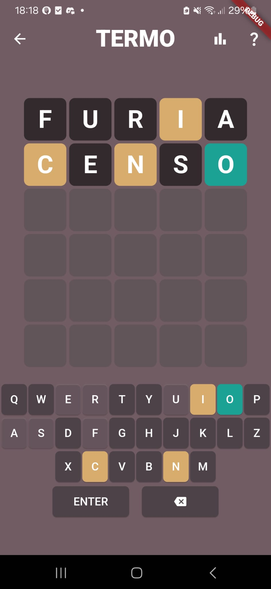

# CM_TermoMobile

This project was developed for the Mobile Computing discipline, with a focus on the user interface of a Flutter application.

For this project, I created a version of Termo. For those who don't know what Termo is, it's essentially the Portuguese version of Wordle, a popular word-guessing game. You can search for it and play it online.

The entire app interface is in English, but the words used in the game are in Portuguese. If you'd like to play with English words instead, you can easily do so by replacing the Portuguese words in the words.json file with five-letter English words

